# Project 3: Design Journey

**For each milestone, complete only the sections that are labeled with that milestone.** Refine all sections before the final submission.

You are graded on your design process. If you later need to update your plan, **do not delete the original plan, leave it in place and append your new plan _below_ the original.** Then explain why you are changing your plan. Any time you update your plan, you're documenting your design process!

**Replace ALL _TODOs_ with your work.** (There should be no TODOs in the final submission.)

Be clear and concise in your writing. Bullets points are encouraged.

Place all design journey images inside the "design-plan" folder and then link them in Markdown so that they are visible in Markdown Preview.

**Everything, including images, must be visible in _Markdown: Open Preview_.** If it's not visible in the Markdown preview, then we can't grade it. We also can't give you partial credit either. **Please make sure your design journey should is easy to read for the grader;** in Markdown preview the question _and_ answer should have a blank line between them.


## Existing Project (Milestone 1)

**Tell us about the project you'll be using for Project 3.**

### Project (Milestone 1)
> Which project will you add interactivity to enhance the site's functionality?

Project 2

### Audience (Milestone 1)
> Briefly explain your site's audience. (1-2 sentences)
> Be specific and justify why this audience is a **cohesive** group.


My site's audience is residents within a 30-mile radius who are interested in attending the Ithaca Apple Harvest Festival. This audience is a cohesive group that includes local residents as well as students from nearby universities such as Cornell and Ithaca College who share a common interest in the festival itself and have uniform goals such as wanting to know the date/time, and location of the festival.


### Audience's Goals (Milestone 1)
> List the audience's goals that you identified in Project 1 or 2.
> Simply list each goal. No need to include the "Design Ideas and Choices", etc.
> You may adjust the goals if necessary.

- Goal 1: Clear Information of Vendors
- Goal 2: Resources for Navigation - Map of Festival (Vendors, Parking, etc.)
- Goal 3: General Festival Information

## Interactivity Design (Milestone 1)

### Modal Interactivity Brainstorm (Milestone 1)
> Using the audience goals you identified, brainstorm possible options for **modal** interactivity to enhance the functionality of the site while also assisting the audience with their goals.
> Briefly explain each idea and provide a brief rationale for how the interactivity enhances the site's functionality for the audience. (1 sentence)
> Note: You may find it easier to sketch for brainstorming. That's fine too. Do whatever you need to do to explore your ideas.

TCAT Routes:
  This modal will pop up when the user clicks on the "All Routes" button under the TCAT Fall 2023 Schedules section on the Locations page. When click, the modal will appear over the entire website with a list of all the possible TCAT routes.  The user can close the modal by clicking "X" in the top right-hand corner. This interactivity enhances the site's functionality for the audience because this provides users with additional information regarding transportation in case the given routes are not sufficient. By making it a modal, it will not crowd the webpage, further enhancing the usability and visual appeal of the site.

Image Gallery Pop-Up (selected modal):
  This modal will pop up when the user clicks on an image in the photo gallery on the About page. When the photo is clicked, the modal will appear will appear over the entire website. The user can close the modal by clicking "X" in the top right-hand corner. This interactivity enhances the site's functionality for the audience because this will allow users to view the "shrunken" images in a clearer view and larger size.

Map Pop-Up:
  Similar to the pop up above, this pop up will appear when the user clicks on the map on the Locations page. When the photo is clicked, the modal will appear will appear over the enetire website. The user can close the modal by clicking "X" in the top right-hand corner. This interactivity enhances the site's functionality for the audience because this will allow users to view the map in a larger size. This will make it easier to read the smaller texts, especially for mobile users.


### Interactivity Design Ideation (Milestone 1)
> Explore the possible design solutions for the interactivity.
> Sketch at least two iterations of the modal and at least two iterations of the hamburger menu interactivity.
> Annotate each sketch explaining what happens when a user takes an action. (e.g. When user clicks this, something else appears.)

First Hamburger Iteration:
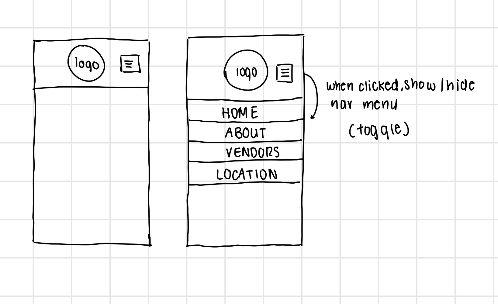
The first iteration has the hamburger menu icon on the right of the logo and when clicked, a drop-down menu displays, taking up the entire width of the screen. The drop-down menu has all the pages separated by a line. When the user clicks on the stacked icon again, the menu becomes hidden.

Second Hamburger Iteration:
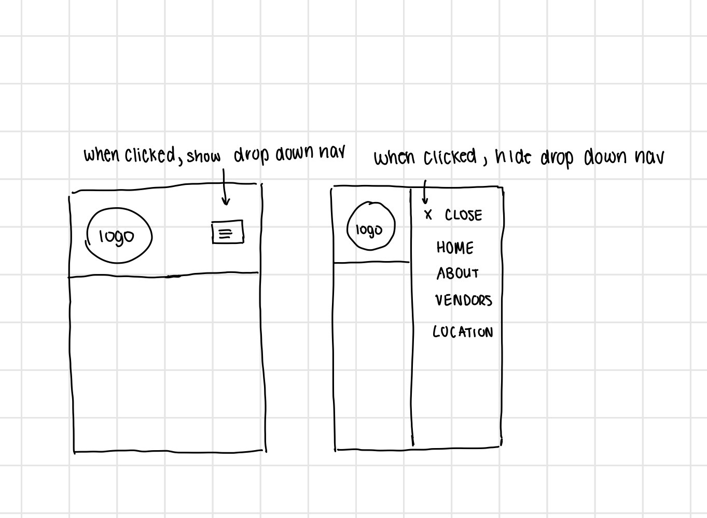
The second iteration has the hamburger menu icon on the left of the logo and when clicked, a drop-down menu displays, taking up 3/4 of the entire screen (from the left edge), and the stacked icon is then changed to an "X." When the user clicks on the "X", the menu becomes hidden.

I selected the second iteration because I thought it would be more visually appealing and accessible for mobile users. It would allow users to scroll on the pages while having the navigation menu out.


First Modal Iteration:
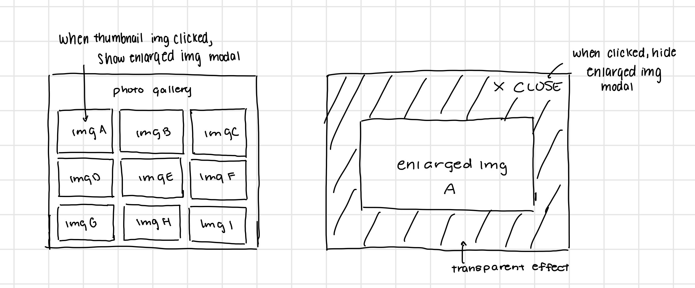
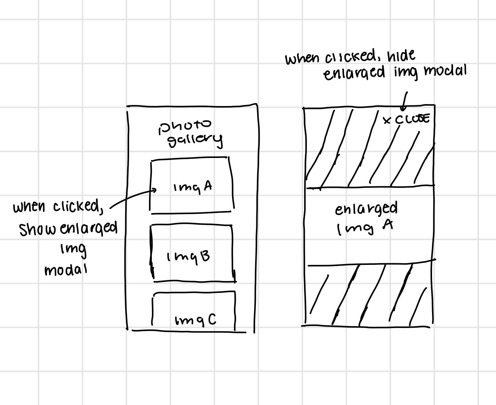

The first iteration of the modal has the enlarged image taking up most but not all of the screen when the user resizes the window to a wide screen. When the user clicks on the thumbnail image from the photo gallery, the enlarged image displays, with an "X Close" button at the right corner of the screen. When the user clicks "X Close," the enlarged image is then hidden and we return back to the initial state of the photo gallery. Similarly, when the user resizes it to a narrow screen and clicks on the initial image in the gallery, the enlarged image displays, with an "X Close" button at the right corner of the screen. When the user clicks on the "X Close," the enlarged image is then hidden and we return back to the initial state.

Second Modal Iteration:
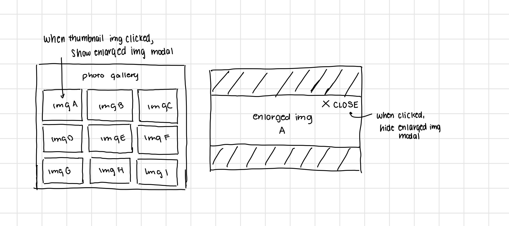
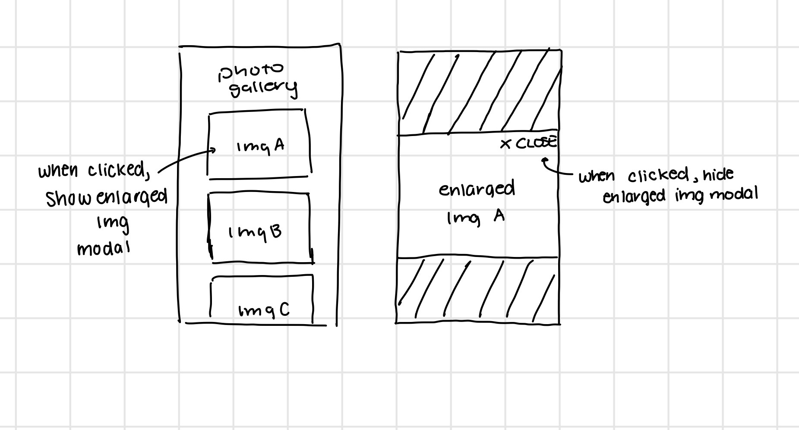

The second iteration of the modal is slightly different. The interactivity remains the same; when the user resizes the window to a wide screen and clicks on the thumbnail image, the enlarged image then appears. However, instead of the "X Close" button showing up at the top right corner of the entire screen, the button is shown on the top right corner of the image. Similarly, when the user resizes it to a narrow screen, clicks on the initial image in the gallery, the enlarged image displays, with an "X Close" button at the right corner of the image. When the user clicks on the "X Close," the enlarged image is then hidden and we return back to the initial state.

I selected the first iteration of the modal because having the close button at the top of the screen rather than on top of the image seems to be a more common design pattern. Also, I realized that having the button on top of the image might make it difficult for users to see it, reducing usability.

### Final Interactivity Design Sketches (Milestone 1)
> Create _polished_ sketch(es) (it's still a sketch, but with a little more care taken to communicate ideas clearly to the graders) to plan your interactivity.
> **Sketch out the entire page where your interactivity will go.**
> Include your interactivity to the sketch(es).
> Add annotations to explain what happens when the user takes an action.
> Include as many sketches as necessary to communicate your design (ask yourself, could another 1300 take these sketches an implement my design?)

**Modal design sketches:**

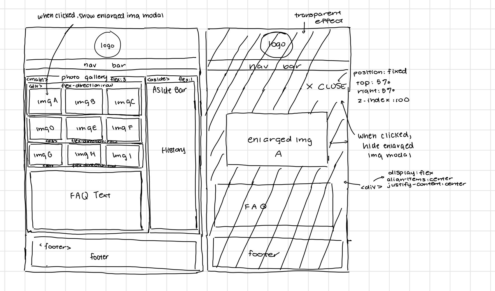
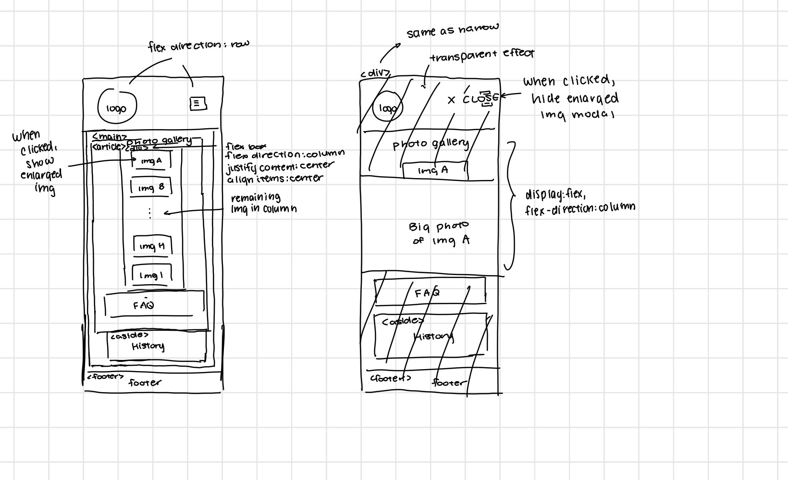

When the user clicks on a thumbnail image from the photo gallery, an enlarged image appears. The modal appears over the entire website. The user could close the enlarged image by clicking on the "X CLOSE" button in the top right-hand corner. The website is visible underneath the modal with some form of transparency effect and the modal should fill the entire screen for narrow and wide widths.

**Hamburger drop-down navigation menu design sketches:**


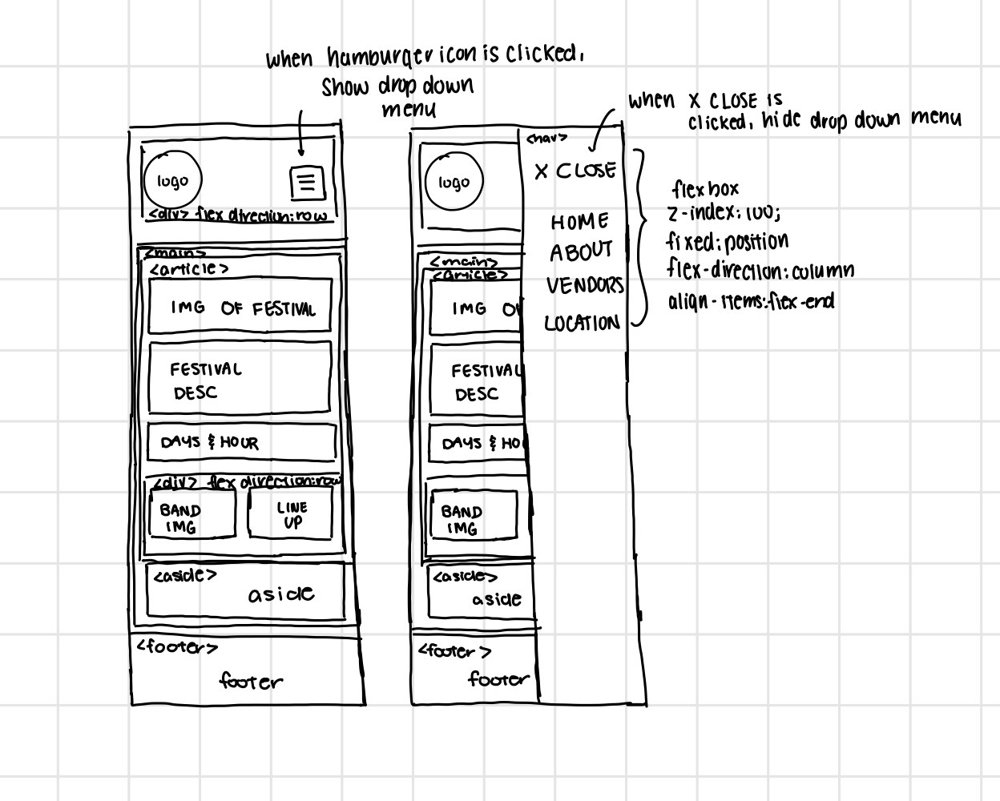
This interactivity design is only shown in the narrow designs. When the user clicks on the hamburger stacked icon, a vertical nav bar drop down menu appears on the right side of the screen (and replaces the horizontal nav bar). The user could close the nav bar by clicking on the "X Close" button in the same spot.


### Interactivity Rationale (Milestone 1)
> Describe the purpose of your proposed interactivity.
> Provide a brief rationale explaining how your proposed interactivity addresses the goals of your site's audience.
> This should be about a paragraph. (2-4 sentences)

The hamburger drop-down navigation menu provides a drop-down navigation menu rather than the original horizontal navigation menu that appears on wide screens, catering to those who might be checking for logistical information on the go, hence the reason they're on a mobile device. By adopting a vertical drop-down menu, users can easily access and select the different pages on the navigation menu. This layout adjustment significantly improves user interaction and ensures a more intuitive and accessible navigation experience, particularly on mobile devices, where horizontal space is limited.

The thumbnail to enlarged photo modal also enhances the usability for my site's audience, by allowing them to explore and inspect high-quality images of the festival. This feature shows a enlarged photo of the original photo when the thumbnail of the photo is clicked from the photo gallery and hides it when users click on "X CLOSE". This interactive feature provides a clearer and larger view, enhancing the overall visual experience and attracting those interested in understanding the essence of the event and seeing what the event is actually like.

## Interactivity Implementation Plan (Milestone 1)

### Interactivity Planning Sketches (Milestone 1)
> Produce planning sketches that include all the details another 1300 student would need to implement your interactivity design.
> Your planning sketches should include _all_ HTML elements needed for the interactivity; _annotations_ for the element types, their unique IDs, and CSS classes; and lastly the initial CSS classes.

**Modal planning sketches:**

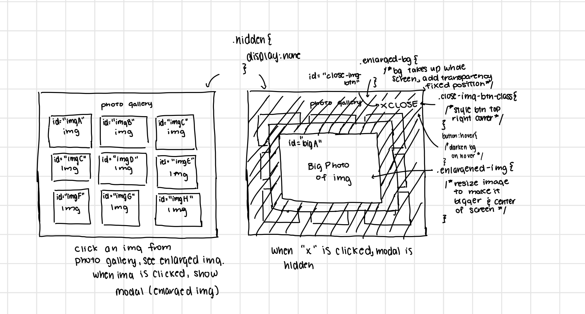
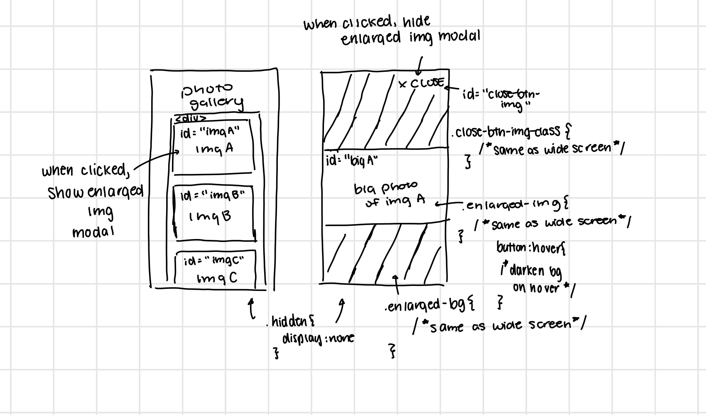

**Hamburger drop-down navigation menu planning sketches:**

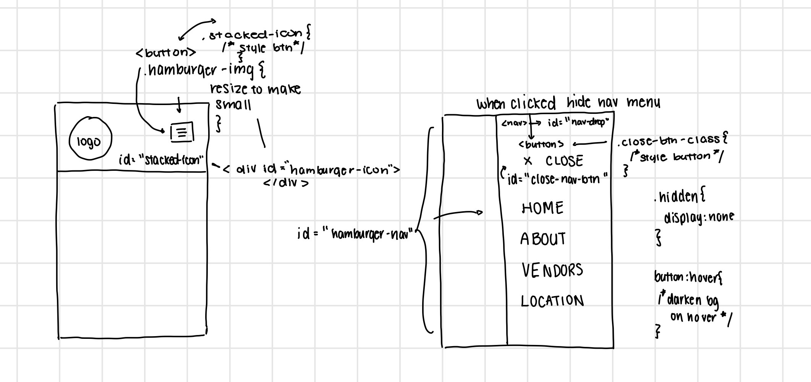

### Interactivity Pseudocode Plan (Milestone 1)
> Write your interactivity pseudocode plan here.
> Pseudocode is not JavaScript. Do not put JavaScript code here.

**Modal pseudocode:**

Open the modal:

```
when #imgA is clicked:
  remove .hidden from #bigA
  remove .hidden from #full-bg
  remove .hidden from #close-img-btn
when #imgB is clicked:
  remove .hidden from #bigB
  remove .hidden from #full-bg
  remove .hidden from #close-img-btn
when #imgC is clicked:
  remove .hidden from #bigC
  remove .hidden from #full-bg
  remove .hidden from #close-img-btn
when #imgD is clicked:
  remove .hidden from #bigD
  remove .hidden from #full-bg
  remove .hidden from #close-img-btn
when #imgE is clicked:
  remove .hidden from #bigE
  remove .hidden from #full-bg
  remove .hidden from #close-img-btn
when #imgF is clicked:
  remove .hidden from #bigF
  remove .hidden from #full-bg
  remove .hidden from #close-img-btn
when #imgG is clicked:
  remove .hidden from #bigG
  remove .hidden from #full-bg
  remove .hidden from #close-img-btn
when #imgH is clicked:
  remove .hidden from #bigH
  remove .hidden from #full-bg
  remove .hidden from #close-img-btn
when #imgI is clicked:
  remove .hidden from #bigI
  remove .hidden from #full-bg
  remove .hidden from #close-img-btn
```

Close the modal:

```
when #close-img-btn is clicked:
  add .hidden to #bigA
  add .hidden to #bigB
  add .hidden to #bigC
  add .hidden to #bigD
  add .hidden to #bigE
  add .hidden to #bigF
  add .hidden to #bigG
  add .hidden to #bigH
  add .hidden to #bigI
  add .hidden to #full-bg
  add .hidden to #close-img-btn
```

**Hamburger menu pseudocode:**

Pseudocode to show/hide (toggle) the navigation menu (narrow screens):

```
when the #hamburger-icon is clicked:
    remove .hidden from #hamburger-nav
    remove .hidden from #nav-drop
when the #close-nav-btn is clicked:
    add .hidden to #hamburger-nav
    add .hidden to #nav-drop
```

Pseudocode to hide the hamburger button and show the navigation bar when the window is resized too wide:

```
when browser width > 600px;
  add hidden to #stacked-icon
  remove hidden from #nav
```

Pseudocode to show the hamburger button and hide the navigation menu when the window is resized too narrow:

```
when browser width  <= 600px:
  remove hidden from #stacked-icon
  add hidden to #nav
```


## Grading (Final Submission)

### Interactivity Usability Justification (Final Submission)
> Explain how your design effectively uses affordances, visibility, feedback, and familiarity.
> Write a paragraph (3-5 sentences)

My design effectively uses affordance because both of my interactive elements, the enlarged image modal and the hamburger-stacked icon, offer visible and clear indications of their functionality. When hovered over, a cursor and or a hover effect occurs, signally their operability. My design also uses visibility as the enlarged image modal appears prominently over the website, maintaining transparency to ensure users see the content beneath, and the hamburger-stacked icon appears clearly on narrow screens, indicating the fact that it's an alternative way of navigation. My design also uses feedback as both interactivity has actions that give an immediate and obvious effect. Clicking on a thumbnail image leads to a pop-up of the enlarged photo and clicking the hamburger icon shows the dropdown menu, confirming the success of their interaction. Lastly, my design uses familiarity as adapting the navigation layout to user screen size and the enlarged photo modal maintains familiar interactive design patterns thats seen on other websites.


### Tell Us What to Grade (Final Submission)
> We aren't re-grading your Project 1 or 2.
> We are only grading the interactivity you added.
> Tell us where (what pages) we can find your interactivity and how to use it.
> **We will only grade what you list here;** if it's not listed, we won't grade it.

- Hamburger Navigation Bar (All Pages)
- Modal (About Page >> Photo Gallery)

### Collaborators (Final Submission)
> List any persons you collaborated with on this project.

N/A

### Reference Resources (Final Submission)
> Please cite any external resources you referenced in the creation of your project.
> (i.e. W3Schools, StackOverflow, Mozilla, etc.)

N/A

### Self-Reflection (Final Submission)
> This was the first project in this class where you coded some JavaScript. What did you learn from this experience?

Though I did have some experience with Javascript before, this was the first time I took full charge of implementing it. The process itself was a learning curve as I got to learn how to utilize JS in conjunction with HTML and CSS. I learned how to utilize the window resizing and the hidden class to add interactivity on my website.


> Take some time here to reflect on how much you've learned since you started this class. It's often easy to ignore our own progress. Take a moment and think about your accomplishments in this class. Hopefully you'll recognize that you've accomplished a lot and that you should be very proud of those accomplishments!

This project presented a greater challenge compared to the previous ones, particularly in handling the creation of multiple classes and IDs. Initially, the amount of classes and IDs was overwhelming, but after taking the time to organize and map them out, I gradually gained a better grasp of their use.

I came to realize the importance of structuring parent classes and div tags. At times, I encountered issues where I assumed certain elements would work seamlessly, only to find that the hierarchical arrangement of tags and classes affected their functionality. Moving forward, I aim to gain more practice in this area to develop a more instinctive understanding of how to effectively organize and implement these components.
